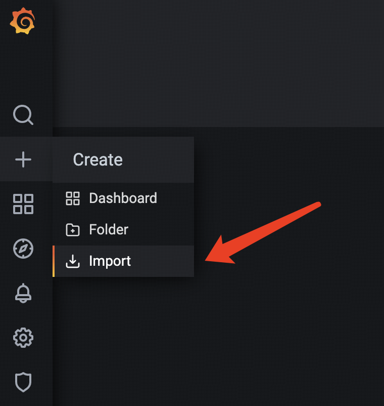

TiCDC
====
TiCDC pulls change logs from TiDB clusters and pushes them to downstream systems, such as MySQL, TiDB, Kafka, Pulsar, and Object Storages (e.g., S3). Beginning from v8.6, we use this repository to build TiCDC instead of the old repository [tiflow](https://github.com/pingcap/tiflow). The new TiCDC in this repository has undergone a complete architectural redesign while retaining the same user interface. The architectural upgrade primarily aims to address certain drawbacks of TiCDC and propel it forward.

* **Better scalability**. E.g. support over 1 million tables.
* **More efficiency**. Use less machine resource to support large volume.
* **Better maintainability**. E.g. simpler and human readable code, clear code module, and open to extensions.
* **Cloud native architecture**. We want to design a new architecture from the ground to support the cloud.

## Quick Start

### Prerequests
TiCDC can be built on the following operating systems:

* Linux
* MacOS

1. Install GoLang 1.23.2
```bash
# Linux
wget https://go.dev/dl/go1.23.2.linux-amd64.tar.gz
sudo tar -C /usr/local -xzf go1.23.2.linux-amd64.tar.gz

# MacOS
curl -O https://go.dev/dl/go1.23.2.darwin-amd64.tar.gz
sudo tar -C /usr/local -xzf go1.23.2.darwin-amd64.tar.gz


export PATH=$PATH:/usr/local/go/bin
export GOPATH=$HOME/go
export PATH=$PATH:$GOPATH/bin
```

### Download the latest release's source code and compile

1. Go to [ticdc/tags](https://github.com/pingcap/ticdc/tags) to find the latest tag, for example `latest-version`

2. Download the repo and checkout the latest tag
```bash
git clone git@github.com:pingcap/ticdc.git
cd ticdc
git fetch origin
git checkout latest-version
```

3. Build TiCDC
```bash
make cdc

# Generate the patchable tar file
cd bin
tar -czf newarch_cdc.tar.gz cdc
```

### Patch the new arch TiCDC to your cluster.
Examples:
```bash
# Scale out the old version TiCDC nodes
tiup cluster scale-out cdc-test scale-out.yml

#scale-out.yml
#cdc_servers:
#  - host: 172.31.10.1

# Patch the new arch TiCDC to the cluster
tiup cluster patch --overwrite cdc-test newarch_cdc.tar.gz -R cdc

# Enable the newarch
tiup cluster edit-config cdc-test
#vim
#cdc_servers:
# ...
# config:
#    newarch: true

tiup cluster reload cdc-test -R cdc
```

### Import the new dashboard to grafana to monitor your workloads
Download [ticdc_new_arch.json](https://github.com/pingcap/ticdc/blob/master/metrics/grafana/ticdc_new_arch.json), and use the import button.

